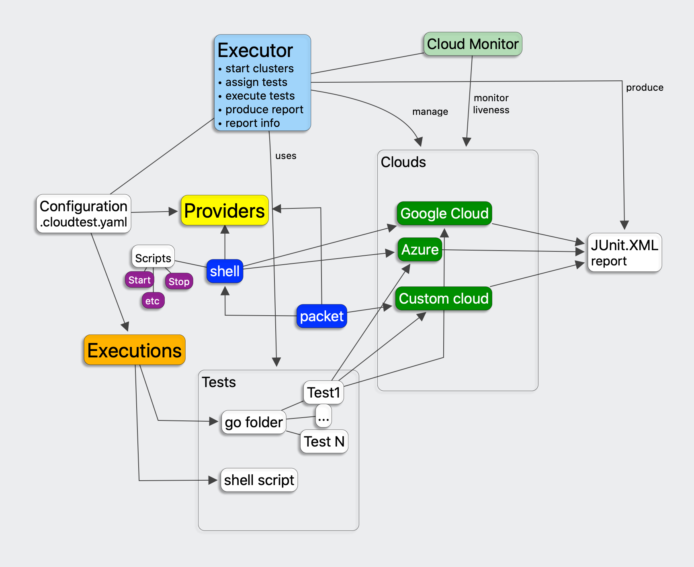
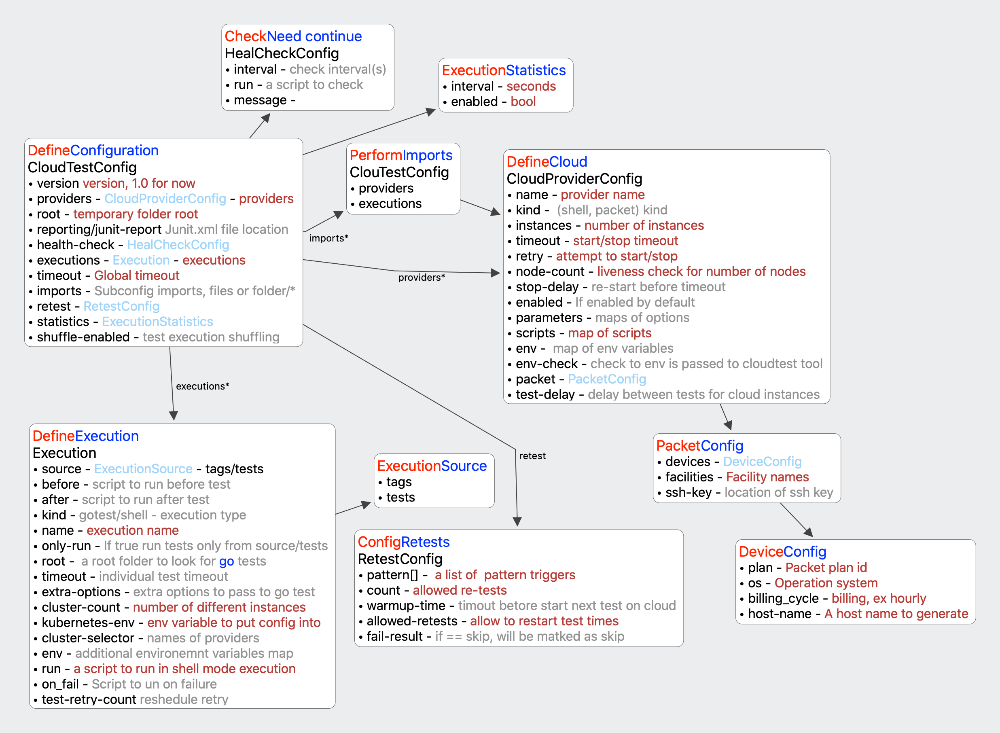
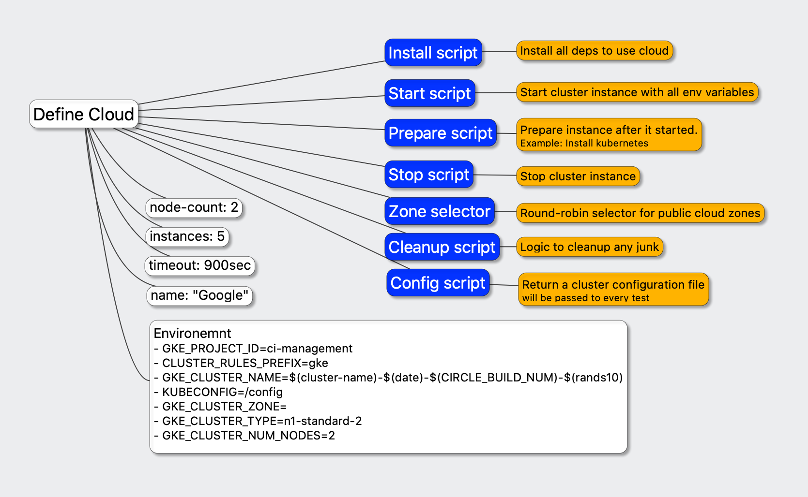

# CloudTest

## Overview

CloudTest is automatic tool to perform integration testing for cloud based environments, 
it allow to configure and bring few multiple clouds to live and execurte go/shell integration tests agains all of clusters 
configured and combine all results into one junit.xml report file to be used with any suitable CI system. 

## Problem Statement

Integration testing agains multiple different cluster systems could be difficult, so this tool is designed to make
this possible to use.


We have few tests, they could be go integration tests or shell scripts we want to check agains every cloud system we want our 
product to work, we need to setup few different cloud systems, with number of instances for every of them and perform 
execution of every test we want agains every cluster with selection of instance we want to run agains. 

And after all this done we want to have a report showing which tests are passed or not, for failed tests we want
some output and results to obtain. 

## Workflow
1. User define configuration:
    * it is used to provide individual instructions to setup every cloud instance.    
    * it define executions:
        * 'go based' folder with tests/or <br/>For `go` it will use `go` command line to obtain a list of individual tests by optionally passing a tag to filter tests. 
        * shell test script - execute it and check for exit code.
2. Start tool, it execute tests against every cloud configuration.
3. After execution:
    * produced JUnit structured XML report file could be used.
    * statistics and details about executions in progress could be used to track exeution.
    * all activities will be captured into individual folders/files for later analysis.      

## Architecture



## Technical Details

### CommandLine reference

`cloudtest` is main executable for tool. It allow to execute all set of individual tests across all clouds provided.

```
Usage:
  cloudtest [flags]
  cloudtest [command]

Available Commands:
  help        Help about any command
  version     Print the version number of cloudtest

Flags:
  -c, --cluster strings   Enable only specified cluster config(s)
      --config string     Config file, default=.cloudtest.yaml
      --count int         Execute only count of tests (default -1)
  -h, --help              help for cloudtest
  -k, --kind strings      Enable only specified cluster kind(s)
      --noInstall         Skip install operations
      --noMask            Disable masking of environment variables in output
      --noPrepare         Skip prepare operations
      --noStop            Skip stop operations
  -t, --tags strings      Run tests with given tag(s) only
```

### Configuration file

CloudTest read .cloudtest.yaml file from current directory or use --config parameter passed as arguments.
Configuration file support include sections with Executions/Providers specified as alternative files.

Full configuration syntax could be checked here: [config.go](../pkg/config/config.go)

Options overview:


* CloudTestConfig - top level element configure basic stuff, support imports and define instance 
configurations and executions.
* CloudProviderConfig - define a cloud configuration.
* Execution - define individual execution.
    * ExecutionSource - specify tags or individual tests to run.
* HealCheckConfig - define a procedure to check if we still need to perform testing, 
it could check for git commits appear in pull request, etc.
* RetestConfig - a way to tweak execution failures caused by cloud instabilities, 
we found few of them during NSM work and found this very useful.
* ExecutionStatistics - enable/disable and interval for runtime statistics.
* PacketConfig/DeviceConfig - a packet specific configuration options.

### Providers

CloudTest architecture support multiple cloud providers, right now few of them are implemented.

At the moment tool support few providers:
* 'shell' - provider, a user control all life cycle of creation and manage of individual instances of 
   cloud using shell scripts.
* 'packet' - a provider for Packet.net hosting, it allow to create Packet devices and uses few shell scripts 
to configure created devices.
   
#### Shell provider

Shell provider is allow us to define every instance as combination of few steps.   


Supported Scripts:
* `Install` script - prepare environment, executed only once per provider. 
Could be used to install all required dependencies.
* `Zone Selector` script - a script to select one or more zones, put randomly selected zone 
into property $(zone-selector) and it could be used to start cloud into different zones. 
Must return individual zones per line of output.  
* `Start` script - used to start an instance of cloud configured. 
Use environment variables for cloud name/etc to make it independent. 
Right now after start will start live-monitoring of Kubernetes cluster to 
check for required number of nodes are available.
* `Prepare` script - Prepare instance after it is started, ex: Install CRDs/etc.
* `Config` script - A script to return Cluster configuration file location, will be called if 
environment variable KUBECONFIG is not specified with configuration.   
* `Cleanup` script - a script to remove old or unused instances, executed at same time as general testing in background.

Example configuration:

```yaml
---
version: 1.0
providers:
  - name: "gke"
    kind: "shell"
    instances: 6
    retry: 5
    node-count: 2
    enabled: true
    timeout: 900  # 15 minutes to start cluster
    env:
      - GKE_PROJECT_ID=ci-management
      - CLUSTER_RULES_PREFIX=gke
      - GKE_CLUSTER_NAME=$(cluster-name)-$(date)-${CIRCLE_BUILD_NUM}-$(rands10)
      - KUBECONFIG=$(tempdir)/config
      - GKE_CLUSTER_ZONE=$(zone-selector)
      - GKE_CLUSTER_TYPE=n1-standard-2
      - GKE_CLUSTER_NUM_NODES=2
      - CA_DIR=./deployments/helm/nsm/charts/spire/
    env-check:
      - GCLOUD_SERVICE_KEY
      - CIRCLE_BUILD_NUM
      - CONTAINER_REPO
      - CONTAINER_TAG
    scripts:
      install: ./.cloudtest/gke/init.sh
      zone-selector: ./.cloudtest/gke/list_zones.sh ci-management  # List zones, but it need GKE_PROJECT_ID to be passed.
      start: |
        make gke-start
      stop: make gke-destroy
      # config: # We do not need it since we put KUBECONFIG into env.
      prepare: scripts/prepare-cluster.sh
      cleanup: |
        ./scripts/gke/destroy-old-clusters.sh 4 "^gke"
```

#### Packet provider.

Packet provider is provider to create devices in Packet.net. 
 
It requires few environment variables to be passed:
* PACKET_AUTH_TOKEN - a token to allow to create devices in.
* PACKET_PROJECT_ID - a project id to create devices in.

Supported Scripts:

* `Install` script - uses to install any deps, executed only once per all instances.
* `Setup` script - perform some initialization logic, at least it should generate or pass a ssh key to be 
used to contact to created devices.
* `Start` script - perform post-start operations, devices are created before calling of this script.
* `Prepare` script - a script to prepare instance after setup is complete.
* `Cleanup` script - a script executed in background to cleanup any of outdated instances.

In compare to shell, `Stop` script is not used since removal of cluster are performed with Packet APIs with deletion of device.

Additional special variables are added to context after Install script and after all devices are created:
* $(device.{Name}.pub.ip.{address_family}) with value to IP4 or IP6 address.
* $(device.{Name}.pub.net.{address_family}) with value to IP4 or IP6 network.
* $(device.{Name}.pub.gw.{address_family}) with value to IP4 or IP6 gateway address.

Example packet configuration:

```yaml
---
version: 1.0
providers:
  - name: "packet"
    kind: "packet"
    instances: 6
    retry: 5
    node-count: 2
    enabled: true
    timeout: 1800  # 30 minutes to start cluster
    env:
      - CLUSTER_RULES_PREFIX=null  # To not add any specific code
      - KUBECONFIG=$(tempdir)/config
      - CLUSTER_NAME=$(cluster-name)-$(date)-${CIRCLE_BUILD_NUM}-$(rands10)
      - CA_DIR=./deployments/helm/nsm/charts/spire/
    env-check:
      - PACKET_AUTH_TOKEN
      - PACKET_PROJECT_ID
      - CIRCLE_BUILD_NUM
    packet:
      ssh-key: sshkey.pub   # A key name relative to $(tempdir) or absolute
      devices:
        - name: "Master"
          host-name: "Master-${CLUSTER_NAME}"
          plan: "t1.small.x86"
          os: "ubuntu_16_04"
          billing-cycle: "hourly"
        - name: "Worker"
          host-name: "Worker-${CLUSTER_NAME}"
          plan: "t1.small.x86"
          os: "ubuntu_16_04"
          billing-cycle: "hourly"
      facilities:
        - baremetal
        - layer_2
        - global_ipv4
      preferred-facility: sjc1
    scripts:
      install: "echo all deps installed"
      setup: |
        ssh-keygen -t rsa -f $(tempdir)/sshkey -q -N "" # Will also generate sshkey.pub
        ssh-add $(tempdir)/sshkey
      start: ./examples/packet/create-kubernetes-cluster.sh $(device.Master.pub.ip.4) $(device.Worker.pub.ip.4) "$(tempdir)/sshkey"
      prepare: echo "Do prepare"
      cleanup: echo "Do cleanup" 
```

### Environment variables processing

Environment variables defined could use ${VAR} syntax to include value existing variable or use few special $(var) 
expressions to include special values.

List of special values:

* $(cluster-name) -  uniq, name of cluster instance usually == "$(provider-id)-NUM"
* $(provider-name) - name of cluster provider defined in config
* $(random) -        random integer value from 0 to 1000000
* $(uuid) -          uuid.New().String()
* $(rands30) -       random string of 30 characters
* $(rands10) -       random string of 10 characters
* $(tempdir) -       location of temporary folder for cluster instance
* $(year) -          today Year
* $(month) -         today Month
* $(date) -          date in format ("%s-%s-%s", todayYear, todayMonth, todayDay)
* $(day) -           today Day
* $(zone-selector) - a value of random selected zone for instance.

### Script execution

Every script defined for individual cluster configuration actions or defined for execution operations are 
split into individual lines by '\n' pattern and support \\{x} substitutions and interpreter support characters inside " as string with spaces.
Before passing to execution every line are substituted with ${} and $() for environment variables and special values.

No other processing are supported right now.


### Executions supported.

Every tests are scheduled for every cloud setup and executed on one of available instances. 
It is possible to define environment variables to be used by every test executed, cloud setup are passed to tests using 
cloud instanceof configuration environment variables. So integration test authors should use this variables to 
tests against required cloud instance.

Every execution produce output and report record with execution status. 
CloudTest tool allow to re-start execution in case of test was timeout execution or log contains some cloud specified problems, 
in this case cloud instance will be restarted and test will be executed again on same or another instance for same cloud setup.
 
Example single cluster execution:

```yaml
executions:
   - name: "Single cluster tests"
     env:
       - STORE_POD_LOGS_IN_FILES=true
     source:
       tags:
         - basic
         - recover
         - usecase
     root: ./test/integration
     timeout: 300
     cluster-count: 1
     cluster-env:
       - KUBECONFIG
     on-fail: |
       make k8s-delete-nsm-namespaces
```


Example of multi-could test, in this case we specify names of provider and different config variables names:

```yaml
---
 executions:
   - name: "Interdomain tests packet-aws"
     env:
       - STORE_POD_LOGS_IN_FILES=true
       - USE_JAEGER_SERVICE=true
     source:
       tags:
         - interdomain
     root: ./test/integration
     timeout: 600
     cluster-count: 2
     cluster-selector:
       - packet
       - aws
     cluster-env:
       - KUBECONFIG_CLUSTER_1
       - KUBECONFIG_CLUSTER_2
     on-fail: |
       make k8s-delete-nsm-namespaces
```