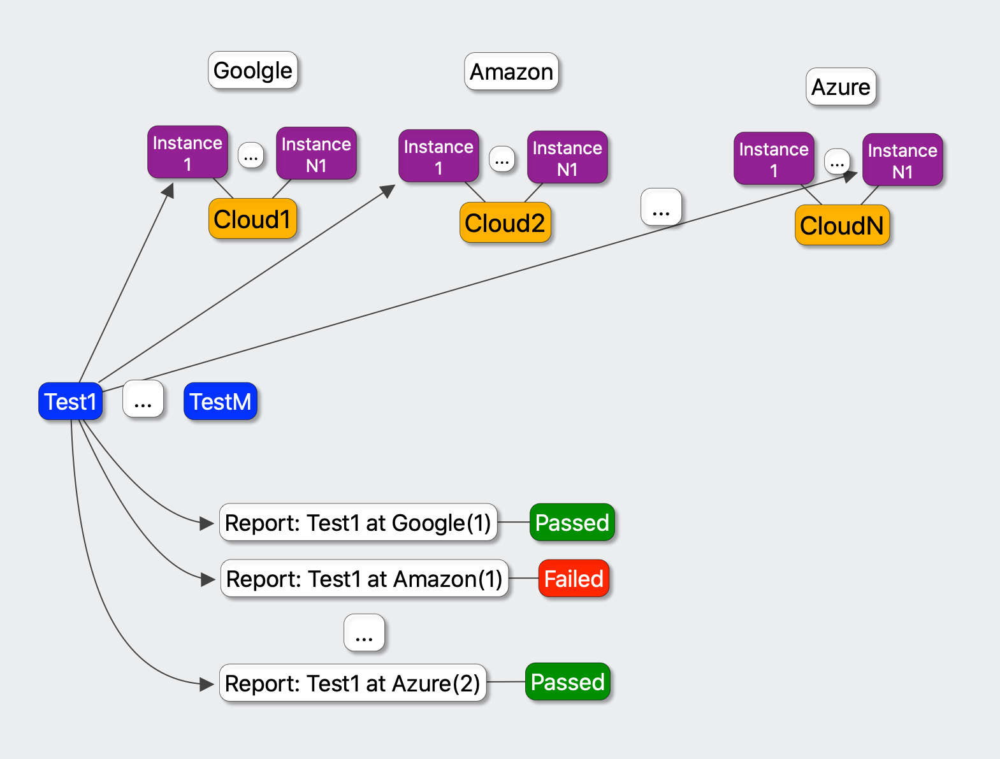

# CloudTest

## Executive Summary

CloudTest is automatic tool to perform integration testing for cloud based environments, 
it allow to configure and bring few multiple clouds to live and execurte go/shell integration tests agains all of clusters 
configured and combine all results into one junit.xml report file to be used with any suitable CI system. 

## Problem Statement

Integration testing agains multiple different cluster systems could be difficult, so this tool is designed to make
this possible to use.

We have few tests, they could be go integration tests or shell scripts we want to check agains every cloud system we want our 
product to work, we need to setup few different cloud systems, with number of instances for every of them and perform 
execution of every test we want agains every cluster with selection of instance we want to run agains. 

And after all this done we want to have a report showing which tests are passed or not, for failed tests we want
some output and results to obtain. 

## What is CloudTest

Cloud test allow us to configure cloud with instances and run tests agains all of them with full utilisation of resources.

CloudTest is configured using `.cloudtest.yaml` file passing configuration of cloud and executions.

### Define Cloud Setup.

Cloud is defined by passing yaml configuration with set of operations to prepare environment, 
create cluster instances, setup them and retrieve configuration to be passed to integration tests.

Full reference at [Define Cloud](define-cloud.md)

### Define Execution. 

`Execution` is set of go/shell tests steps to be performed on every different cloud setup. 
Every execution are defined by go root or shel script, and consist of one or more intergation tests.

Every tests are scheduled for every cloud setup and executed on one of available instances. 
It is possible to define environment variables to be used by every test executed, cloud setup are passed to tests using 
cloud instanceof configuration environmet variables. So integration test authors should use this variables to 
tests agains required cloud instance.

Every execution produce output and report record with execution status. 
CloudTest tool allow to re-start execution in case of test was timeout execution or log contains some cloud specified problems, 
in this case cloud instance will be restarted and test will be executed again on same or another instance for same cloud setup.

Full reference at [Define Execution](define-execution.md) 
