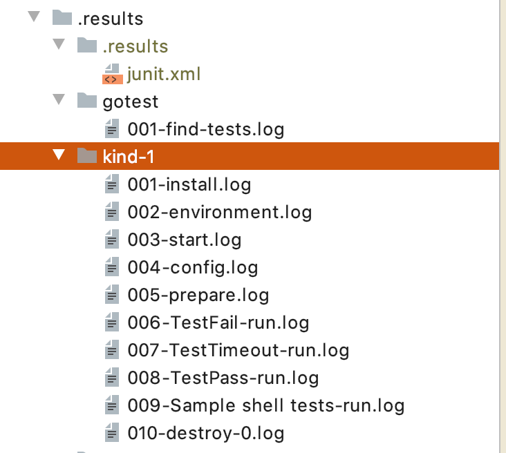

# Kind shell provider example

CloudTest could be configured to control any kind of shell based clusters.

Running `cloudtest` inside this folder will trigger setup of Kind tool and execution 
of 4 tests against this cloud, tests are dummy ones and just print current cluster config
passed. One of tests are failed to show how results will look.

## Configuration
Sample configuration contains 2 executions, one is go test folder and one is simple script.

Configuration could be checked here: [.cloudtest.yaml](./.cloudtest.yaml)

## Runtime information
During execution CloudTest will print execution statistics and information about cluster starting, etc.

```
INFO[0090] Statistics:
        Elapsed total: 1m30s
        Tests time: 1m30s
        Tasks  Completed: 0
               Remaining: 4 (~)

        Clusters:
                Cluster: kind Tasks left: 4
                        kind-1: starting, uptime: 1m31s

        Status  Passed: 0
        Status  Failed: 0
        Status  Timeout: 0
        Status  Skipped: 0 

```

## Results

### JUnit XML
After execution it will create `./results/junit.xml` file to integrate to CI systems.
Report file is extended with human readable comments and separated to suits based on executions defined. 
```xml
  <testsuites>
      <testsuite tests="4" failures="1" time="8.611661254" name="All tests">
          <properties></properties>
          <!--Suite was running for 9s-->
          <testsuite tests="3" failures="1" time="8.601430726" name="Sample go tests">
              <properties></properties>
              <!--Suite was running for 9s-->
              <testsuite tests="3" failures="1" time="8.601430726" name="kind">
                  <properties></properties>
                  <!--Suite was running for 9s-->
                  <testcase classname="" name="TestFail" time="1.5906759560000001" cluster_instance="kind-1">
                      <failure message="Test execution failed TestFail" type="ERROR">Execution attempt: 0 Output file: .results/kind-1/006-TestFail-run.logStarting TestFail on kind-1&#xA;Command line go test . -test.timeout 2m0s -count 1 --run &#34;^(TestFail)$\\z&#34; --tags &#34;&#34; --test.v&#xA;env==[KUBECONFIG=/Users/haiodo/Develop/git/cisco/go/src/github.com/networkservicemesh/cloudtest/examples/kind/.results/shell/kind-1/config]&#xA;&#xA;=== RUN   TestFail&#xA;time=&#34;2020-01-17T22:23:20+07:00&#34; level=info msg=&#34;Failed test: /Users/haiodo/Develop/git/cisco/go/src/github.com/networkservicemesh/cloudtest/examples/kind/.results/shell/kind-1/config&#34;&#xA;--- FAIL: TestFail (0.00s)&#xA;sample_test.go:35:&#xA;Expected&#xA;&lt;string&gt;: fail&#xA;to equal&#xA;&lt;string&gt;: success&#xA;FAIL&#xA;FAIL&#x9;github.com/networkservicemesh/cloudtest/examples/kind/tests&#x9;0.577s&#xA;FAIL&#xA;TestFail: OnFail: running on fail script operations with KUBECONFIG=/Users/haiodo/Develop/git/cisco/go/src/github.com/networkservicemesh/cloudtest/examples/kind/.results/shell/kind-1/config on cloud kind-1&#xA;Do cleanup on failure # In case of execution failure this script will cleanup after test</failure>
                  </testcase>
                  <testcase classname="" name="TestTimeout" time="6.084703559" cluster_instance="kind-1"></testcase>
                  <testcase classname="" name="TestPass" time="0.926051211" cluster_instance="kind-1"></testcase>
              </testsuite>
          </testsuite>
          <testsuite tests="1" failures="0" time="0.010230528" name="Sample shell tests">
              <properties></properties>
              <!--Suite was running for 0s-->
              <testsuite tests="1" failures="0" time="0.010230528" name="kind">
                  <properties></properties>
                  <!--Suite was running for 0s-->
                  <testcase classname="" name="Sample shell tests" time="0.010230528" cluster_instance="kind-1"></testcase>
              </testsuite>
          </testsuite>
      </testsuite>
  </testsuites>
```

### Logs structure

During execution for every operation CloudTest produce log files, start of cluster instances, 
execution of tests all are marked as operation and be stored into separate files.

 

All operations could be checked in case of test failures or cluster instance errors.